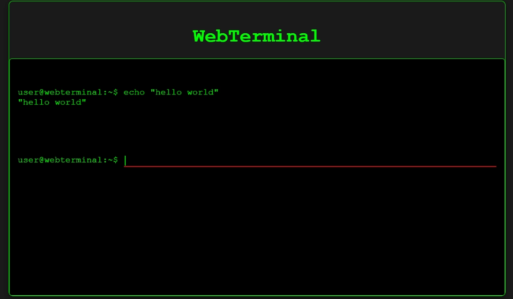

# WebTerminal

A simple web-based terminal built with Flask. This terminal allows users to execute basic commands via a browser interface and displays the output in real-time.

## Features
- **Web-based interface**: Accessible from any device with a web browser.
- **Security Measures**: Uses subprocess to securely handle commands.

## Screenshots


## Setup

### Prerequisites
Ensure you have the following installed:
- Python 3.x
- Flask (`pip install Flask`)

### Installation
1. Clone this repository:
    ```bash
    git clone https://github.com/Amitminer/WebTerminal.git
    cd WebTerminal
    ```

2. Install required dependencies:
    ```bash
    pip install Flask
    ```

3. Run the application:
    ```bash
    python terminal.py
    ```

4. Access the WebTerminal in your browser:
    ```bash
    http://localhost:5000
    ```
    
Feel free to expand the list of commands by modifying `terminal.py`.

### Deployment
For deploying the app on a server, you can use services like **Linode**, **AWS**, or a VPS. To run it on a VPS:

1. Install Python and Flask on the VPS.
2. Run `python terminal.py` on the server.
3. Access the terminal using the server's IP address and port (default port: 5000). 
   You can change the port in `terminal.py` by modifying the last line:  
   ```python
   app.run(host='0.0.0.0', port=your_port)
   ```

## Customization
You can customize the terminal's appearance by editing the HTML and CSS in the `terminal.py` template string. Change colors, fonts, or layout as per your needs.

